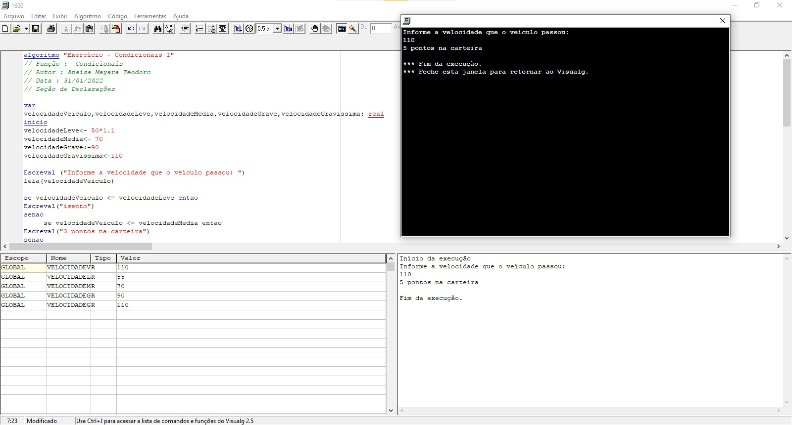
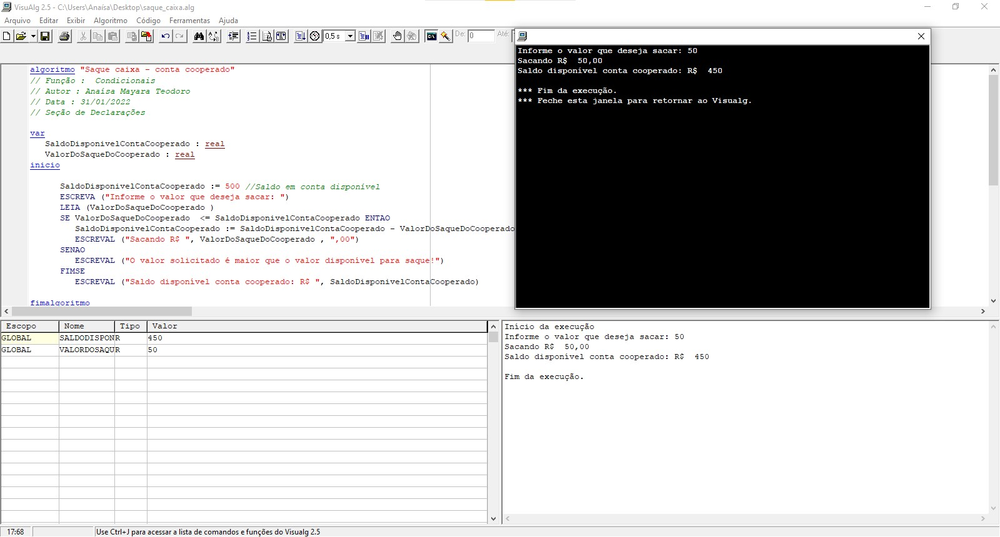

# Progrid- Curso de Lógica de programação I

 PROGRID - PROGRAMA DE INTREGRAÇÃO E DESENVOLVIMENTO DE COOPERADOS E COMUNIDADE 

 * Categoria do Curso: competências profissionais | Lógica de programação I | 2022  
 * Tal curso EaD é oferecido pela VIACREDI em parceria com a escola ProWay da cidade de Blumenau/SC
 * Instrutor: Marcelo Bernadi

# Conteúdos
---

* [Pré-requisitos](#Pré-requisitos)
* [Introdução](#Introdução)
* [Algoritmo](#Algoritmo)
* [Constantes,variáveis,tipos](#Constantes,variáveis,tipos)
* [Tipos de variáveis](#Tiposdevariaveis)
* [Operadores](#Operadores)
* [Prioridade de Operadores](##PrioridadedeOperadores)
* [Exercícios](#Exercicios) 
* [Vamos para prática!](#Vamosparaprática!)

---
# Pré-requisitos

* Estar matriculada no PROGRID;
* Disponibilidade de 20 horas para participar de tal curso;
* Possuir um computador ou mobile para acesso a plataforma;
* Ter disponibilidade de internet;
* Disponibilidade em aprender; 
* Instalar o Visualg (qualquer versão); 
* Realizar atividade final;
* Terminar o curso;
---

# Introdução

- Compreender e elaborar Algoritmos.
- Tomar conhecimento do que são tipos de dados e trabalhar com eles.
- Entender variáveis, funções, constantes, condicionais e diversas outras questões que visam o conhecimento para o desenvolvimento no computador e que venham a prepara-lo para atuar com linguagens diversas e muitas outras formas de programação.

# Algoritmo

Usualmente no mundo da programação, utiliza-se como forma de representação de um algoritmo, o pseudocódigo e fluxograma ou diagrama em blocos.

O foco deste curso está direcionado a representação por via do pseudocódigo, que nada mais é que uma alusão a uma posterior implementação de uma linguagem de programação.
 

O objetivo do uso de pseudocódigo é que deve ser fácil de interpretar e fácil de codificar, já que tem o intuito de ser o intermediário entre a linguagem falada e a linguagem de programação.

Neste caso, o interpretador utilizado foi o VisualAg, que foi baseado na estrutura da linguagem Pascal. Tal interpretador permite simular o processo de uma tarefa que deve ser executada como um programa de computador. Aonde, todo processo sempre tem que ter: INÍCIO –> MEIO –> FIM.

Na linguagem do pseudocódigo, há um conjunto de palavras que expressam ações que determinam o que será feito. Tais palavras como: escreva, leia, enquanto etc.,  são chamadas de reservadas no sentido de que elas são únicas e não podem ser refinadas, ou seja, detalhadas. As palavras reservadas serão sublinhadas para a sua identificação.

# Constantes,variáveis,tipos

- Variáveis e constantes são os elementos básicos (identificadores) que um programa manipula.

- Uma variável é um espaço reservado na memória do computador para armazenar um tipo de Dado determinado. Armazenar valores para poder manipulá-los. Dessa forma, criamos variáveis para armazenar esses valores.

- Já a constante é um determinado valor fixo que não se modifica ao longo do tempo, durante a execução de um programa.

# Tipos de variáveis

- As variáveis são utilizadas para armazenar as constantes de um programa e podem ser classificadas como sendo do tipo numérico, literal ou lógico. 

- Cada variável declarada deverá ter seu tipo pré-definido e poderá armazenar constante somente daquele tipo. Por exemplo, uma variável numérica somente poderá armazenar números.

- Sempre que precisarmos utilizar uma variável precisamos declará-la. 

Identificamos o nome da variável e o seu tipo correspondente ao qual existe uma regra para criação delas, como inserir sem caracteres especiais, etc e respeitando as boas práticas do desenvolvimento em programação. 

Já para atribuir um valor a variável é utiliza-se a sintaxe desse comando (comando que atribui valor) com a identificação de uma seta entre o identificador e o valor a ser armazenado.

# Operadores

- Operadores são elementos funcionais que atuam sobre operandos e produzem um determinado resultado. Vejamos:

## Operadores aritméticos:

Aritmético|   Operação    | Descrição
----------| --------------| ---------
    +     |adição         | Faz a soma de dois números
    -     |subtração      | Faz a subtração de um número pelo outro
    *     |multiplicação  | Faz a multiplicação de um número pelo outro
    /     |divisão        | Faz a divisão de um número pelo outro
    ^     |potenciação    | Faz a elavação de um número a uma potência

## Operadores relacionais:

Relacional|   Operação    | Descrição
----------| --------------| ---------
    =     |   Igualdade   | Verifica se dois valores são iguais. Se forem iguais, o teste de igualdade é verdadeiro, senão, é falso.
    <>    |   Diferença   | Verifica se dois valores são diferentes. Se forem diferentes, o teste é verdadeiro, senão, é falso.
    <     |   Menor que   | Verifica se um número é menor do que o outro
    >     |   Maior que   | Verifica se um número é maior do que o outro
    <=    | Menor ou igual| Verifica se um número é menor ou igual ao outro
    >=    | Maior ou igual| Verifica se um número é maior ou igual ao outro

## Operadores lógicos

    Lógico   |Operação    |Descrição
    E        |Intersecção | Operação de conjunção
    Ou       |União       | Operação de disjunção
    Não      |Negação     | Operação de Negação

## Prioridade de Operadores

Durante a execução de uma expressão que envolve vários operadores, são necessárias a existência de prioridades, caso contrário, poderemos obter valores que não representam o resultado esperado.A maioria das linguagens de programação utiliza as seguintes prioridades de operadores:

* 1.Efetuar operações embutidas em parênteses “mais internos”.
* 2.Efetuar funções.
* 3.Efetuar multiplicação e/ou divisão.
* 4.Efetuar adição e/ou subtração.
* 5.Operadores relacionais.
* 6.Operadores lógicos. Nos operadores lógicos, a prioridade mais alta e a negação, depois a operação e, e por fim a operação ou.

# Exercícios
Os exercícios estão numa pasta aqui do repositório.

# Vamos para prática!

Participando deste curso, foi possível compreender a introdução de comandos de entrada e saída dos algoritmos, praticados por via de pseudocódigos. Ao qual permitiu a simulação de estudos de programação sequencial e condicional. 

Concludente, certificou-se por meio da realização de exercícios (você pode conferir numa pasta aqui no repositório) em relação aos conteúdos aprendidos. Dos quais, são fundamentais para a nossa base de experiência, na construção das etapas e estruturação de algoritmos. Além de simular o seu futuro uso, numa dada linguagem de programação ao qual se destinará. Então, o lema é o de conferir e praticar. Grata pela atenção!

### Eu sou, a Anaísa 😃 (Propagadora de educação cooperativista e eterna aprendiz!)
- [Twitter](https://twitter.com/AnaisaMayara)
- [Linkedin](https://www.linkedin.com/)
- [Github](https://github.com/anaisateodoro)
- [Email](anaisateodoro@hotmail.com)

# curso-introducao-logica-programacao
